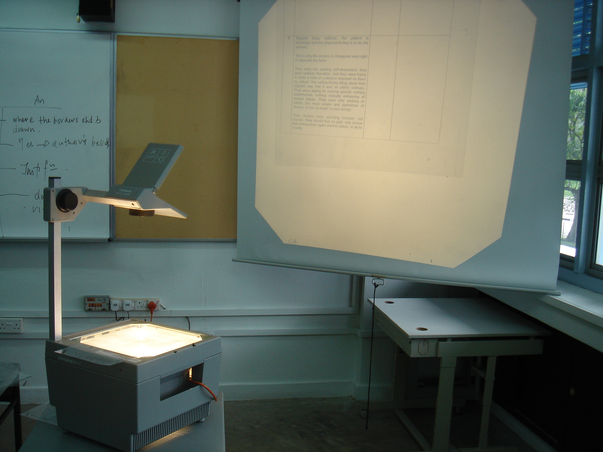
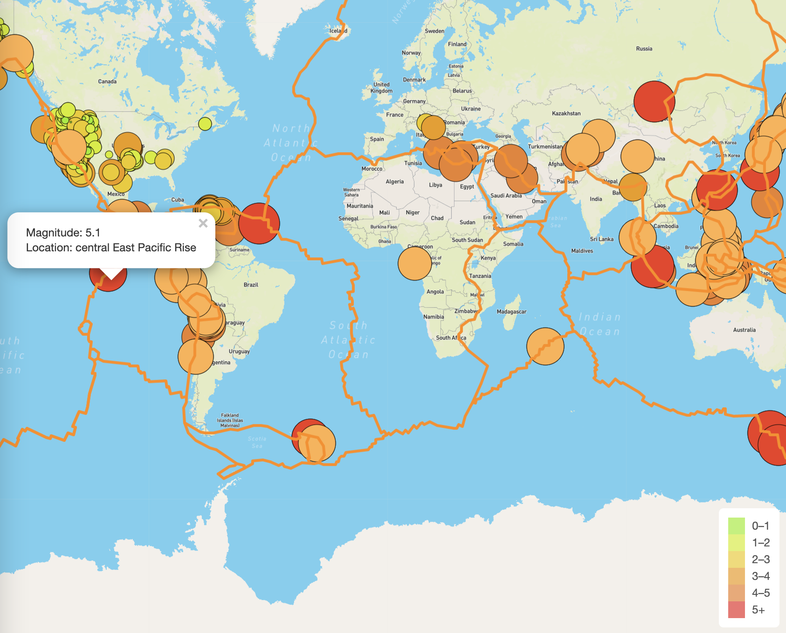

# Mapping-Earthquakes
Columbia Module 13 - Mapping Earthquakes using JS and learning Git essentials

## What I Learned/Achieved:
- Created a branch from the main branch on Github.
- Added, committed, and pushed data to a Github branch.
- Merged a branch with the main branch on Github.
- Retrieved data from a GeoJSON file.
- Made API requests to a server to host geographical maps.
- Populated geographical maps with GeoJSON data using JavaScript and the data-driven documents (D3) library
- Added multiple map layers to geographical maps using Leaflet control plugins to add user interface controls.
- Used JavaScript ES6 fucntions to add GeoJSON data, features, and interactivity to maps.
- Rendered maps on a local server.

## Purpose:
The purpose of this challenge was to show data from earthquakes compared to tectonic plates' location. I show the earthquakes with a magnitude greater than 4.0 on the Richter Scale on the map. The map was created with a JSON request from Mapbox. It provides a new style of choice that can be used to show visualize the analytics of the different earthquakes in the datasets.

## Method:
The method starts with finding a source of data that includes active and historical earthquakes. Second, generate an API token for the MapBox website, and then it was important to access that data with a script in Java. Building from the most basic of maps to adding extra layers of lines and points. It was similar to an overhead projector.

- _Layer 1_: the map;
- _Layer 2_: the map with lines;
- _Layer 3_: the map with lines and dots;
- _Layer 4_: the map with lineds, dots, and earthquake data;
- _Layer 5_: added design to Layer 4.

## Project Deliverable:

